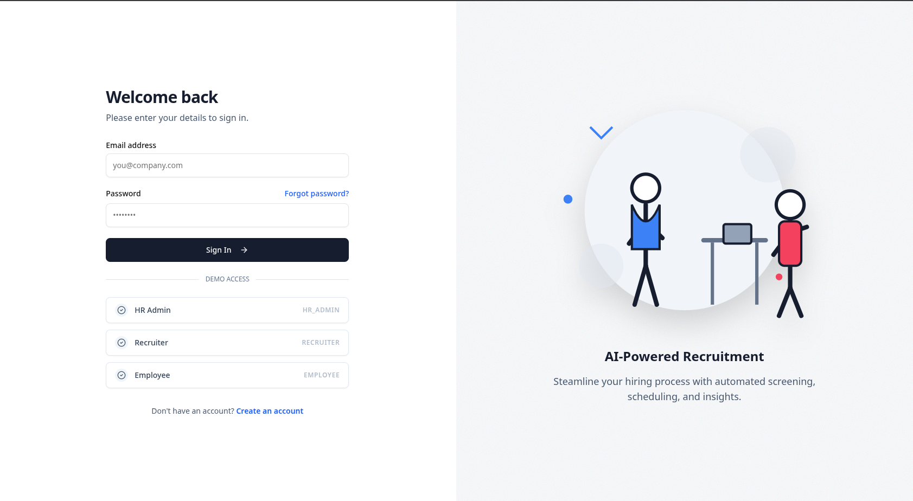

<div align="center">

# Hirely

**Intelligent Recruitment, Simplified.**

[View Live Demo(Current Status: Active Refactoring for Scalability. Redeployment in progress)](https://hirelyy.vercel.app/)

<br />

[](https://nextjs.org/)
[](https://reactjs.org/)
[](https://tailwindcss.com/)
[](https://bun.sh/)
[](https://supabase.com/)

<br />



</div>

<br />

<table>
<tr>
<td width="55%" valign="top">

## What is Hirely?

Hirely is an AI-powered platform that automates recruitment. It helps HR teams find the right talent faster by handling resume screening and initial interviews.

### Features

- **AI HR Assistant**  
  Chat with your database. Ask "Who knows React?" and get instant answers.

- **Contextual Resume Scoring & Insights**  
  Rank resumes (0-100) based on job requirements. Get detailed AI-generated insights on candidate strengths, weaknesses, and suggested interview questions.

- **Seamless Integrations**  
  Connect **Gmail** and **Google Drive** to automatically sync and process resumes from your emails and folders.

- **Smart Batch Processing**  
  Upload or sync dozens of resumes at once with real-time progress tracking and deduplication.

- **AI Interviews**  
  Automated screening rounds with an AI interviewer.

- **Centralized Dashboard**  
  Manage candidates, track integration status, and view ranked applicants in one place.

</td>
<td width="45%" valign="top">

## Tech Stack

**Frontend**
<br>


**Backend**
<br>


**Data & Infra**
<br>


</td>
</tr>
</table>

## Quick Start

Run Hirely locally in minutes.

```bash
# 1. Clone
git clone https://github.com/mohdarsh786/hirely
cd hirely

# 2. Backend
cd api
bun install
bun run dev

# 3. Frontend
cd web
bun install
bun run dev
```

Visit `http://localhost:3000`

---

<div align="center">
  <sub>Built for Innovex TBI Hackathon</sub>
</div>
